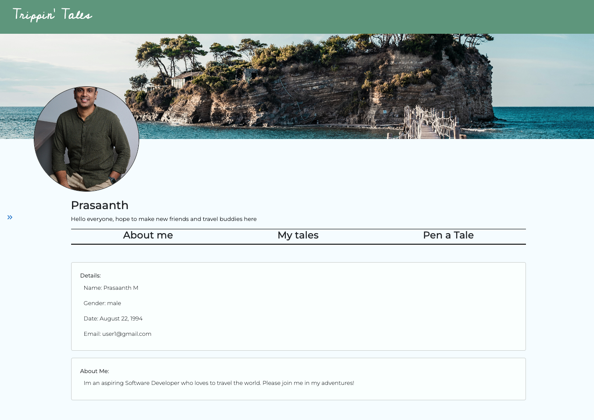
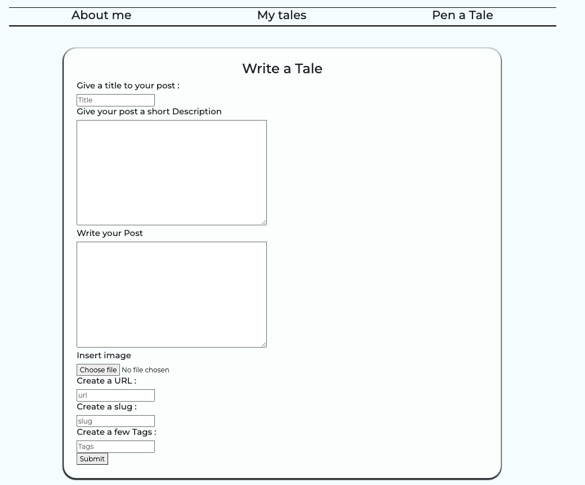
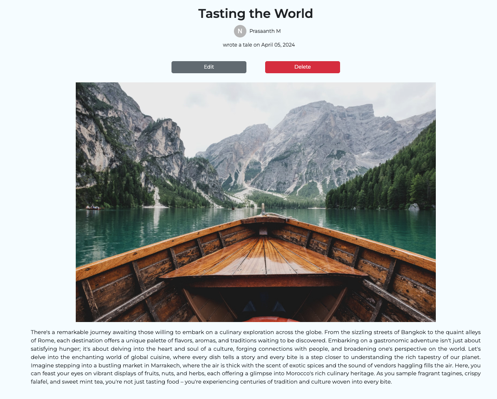
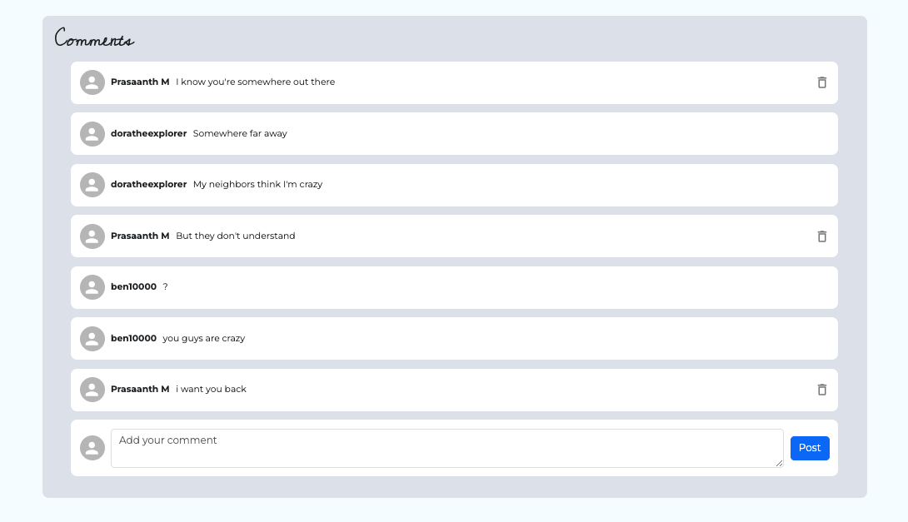
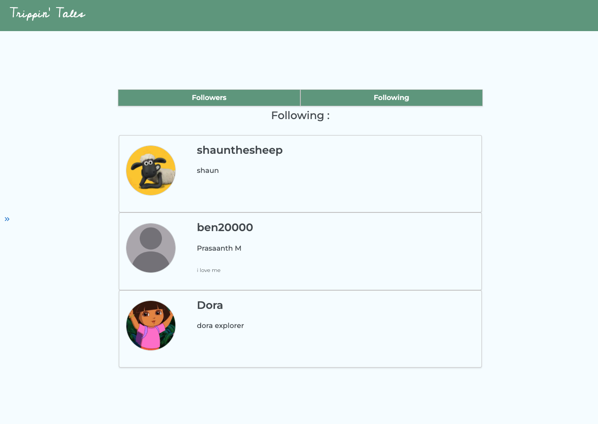
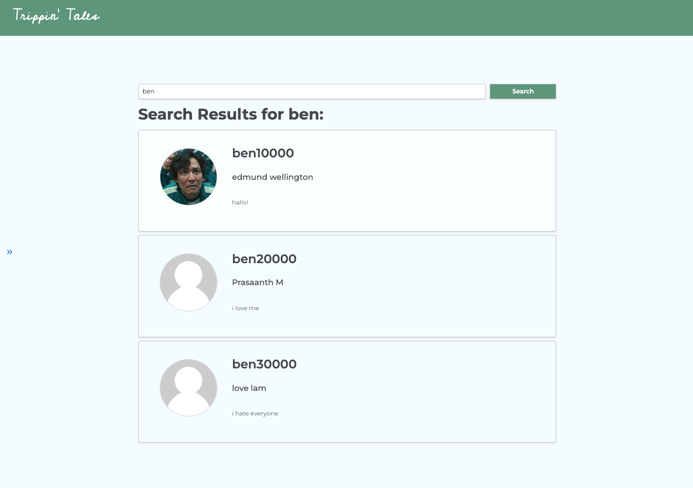

# Trippin' Tales

We are three globe-trotting enthusiast bound by our shared passion for exploration. United by our love for adventure and frustration with fragmented travel platforms, we embarked on a journey to create a revolutionary travel blog app - Trippin' Tales to serve the travel community.

Trippin' Tales revolutionizes the travel experience by addressing the common pain points faced by travelers. Through its intuitive platform, users can seamlessly plan their trips, document their adventures, and engage with a vibrant community of fellow travelers.

Features of Trippin’ Tales:

- Streamlines the trip planning process by offering a range of tools and resources
- Built-in editing tools and templates to help users craft visually stunning content effortlessly
- Users can follow other travelers, discover new destinations, and participate in discussions on various travel-related topics

# Screenshot

# Technologies Used

# Getting Started

# Next Steps

# ENV Variables
