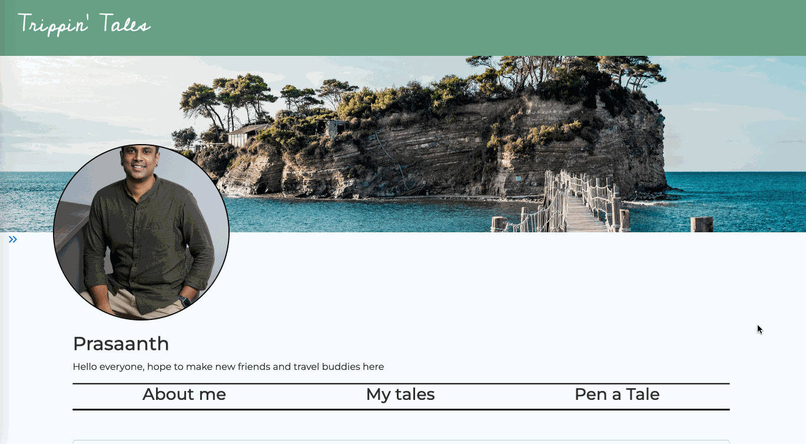
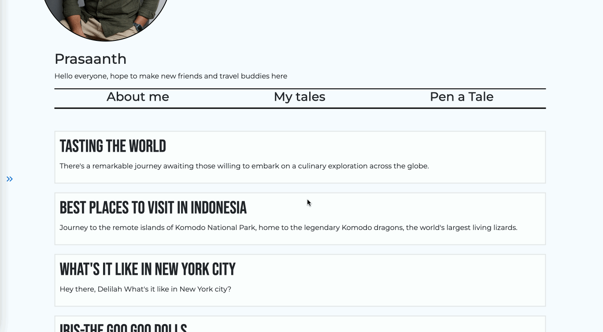
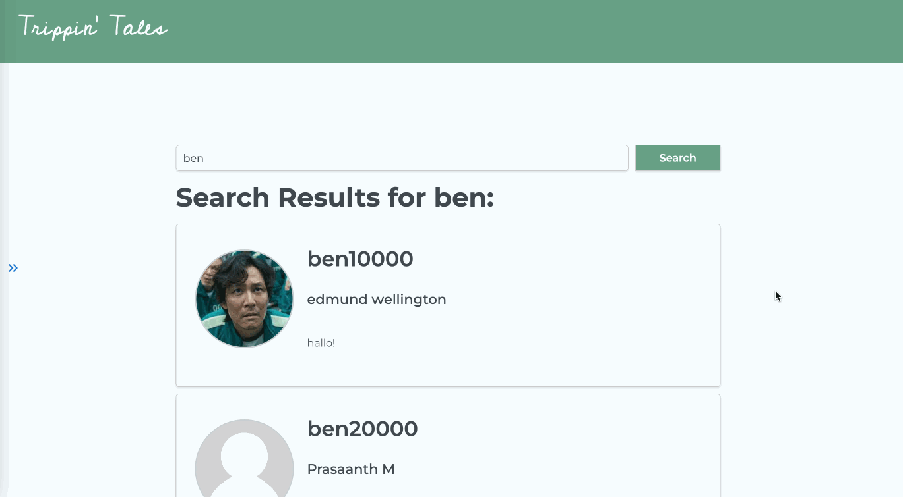

# Trippin' Tales

We are three globe-trotting enthusiast bound by our shared passion for exploration. United by our love for adventure and frustration with fragmented travel platforms, we embarked on a journey to create a revolutionary travel blog app - Trippin' Tales to serve the travel community.

Trippin' Tales revolutionizes the travel experience by addressing the common pain points faced by travelers. Through its intuitive platform, users can seamlessly plan their trips, document their adventures, and engage with a vibrant community of fellow travelers.

**Features of Trippin’ Tales:**

- Streamlines the trip planning process by offering a range of tools and resources
- Built-in editing tools and templates to help users craft visually stunning content effortlessly
- Users can follow other travelers, discover new destinations, and participate in discussions on various travel-related topics

# Screenshot

#### Landing page for sign-ups and login


#### Manage your profile and pen a tale on the profile page



#### Manage your post and interact with other users in the comment section



#### Search for fellow travelers by their username


#### Make connections by following your favourite user



# Technologies Used

- React
- JSX
- CSS
- Node JS
- Material UI
- Bootstrap
- AWS S3

# Getting Started

### Backend Setup

1. Run `npm init -y` to initialize the project and create a package.json file
2. Install all the packages and dependencies `npm i dotenv express-validator mongoose jsonwebtoken bcrypt uuid cors helmet express-rate-limit`
3. Create your .env file with the following variables:

```
PORT=5001
MONGODB_URI
ACCESS_SECRET=<YOUR_ACCESS_SECRET>
REFRESH_SECRET=<YOUR_REFRESH_SECRET>
```

### Frontend Setup

1. Run `npm i` to install all the dependencies
2. Run `npm i react-router-dom` to install react-router-dom
3. Run `npm i @mui/material @emotion/react @emotion/styled` to install Material UI
4. Run `npm i @mui/icons-material` to install Material UI icons
5. Run `npm i jwt-decode` to install jwt-decode
6. Create your .env file with the following variables:

`VITE_SERVER=http://localhost:5001`

# Next Steps

1. Search input and button on Navbar
2. 'Wall page' to view posts of others the user follows
3. CSS touchups
4. Like/Favourite feature + page which can serve as a reference or bookmark
